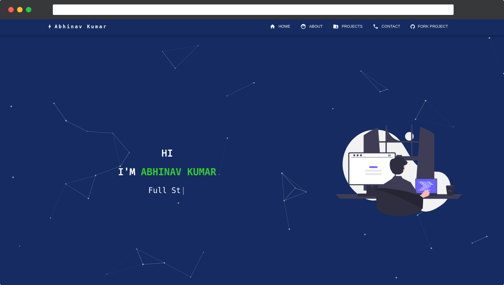

# My portfolio

My portfolio built using React JS



[](https://forthebadge.com)
[](https://forthebadge.com)

## Demo

https://my-portfolio-abhinav2011.vercel.app/


## Run Locally

Clone the project

```bash
  git clone https://github.com/Abhinav2011/my-portfolio
```

Go to the project directory

```bash
  cd my-portfolio
```

Install dependencies

```bash
  npm install
```

Start the server

```bash
  npm start
```

## Run using Docker

Pull docker image

```bash
docker pull abhinav2011/abhinav-portfolio
```

Run the docker image

```bash
docker run -p 5173:5173 abhinav2011/abhinav-portfolio
```
